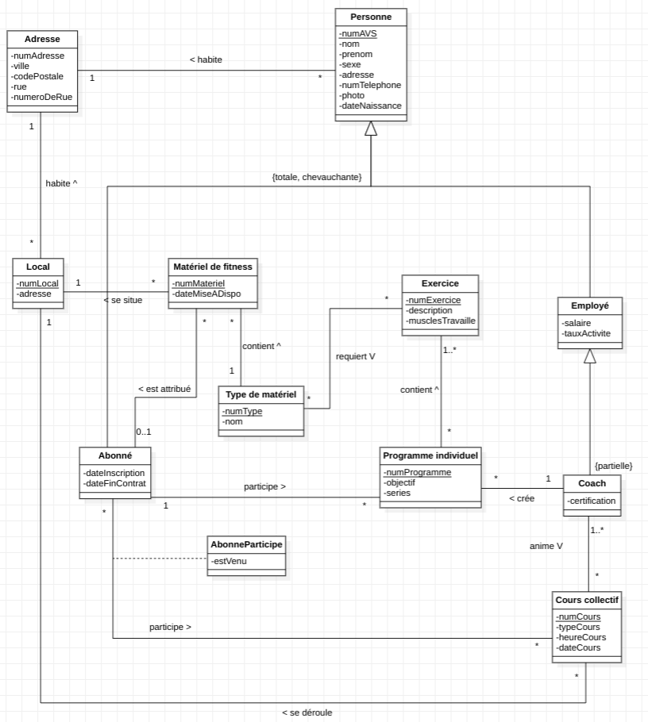
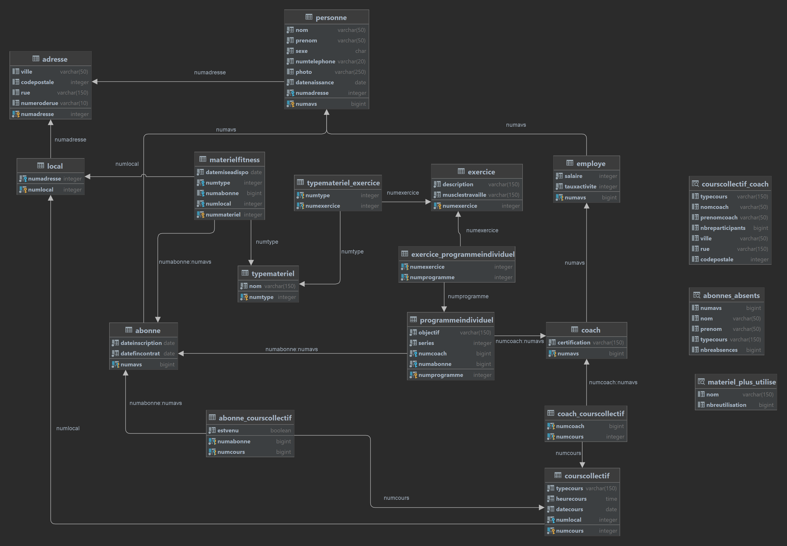

# Fitnext - Projet BDR Rapport
Auteurs : Miguel Jalube, Paul Gillet, Leandro Saraiva Maia  
Date : 22 janvier 2023  
HEIG Yverdon  

Ce document est une compilation de tout les documents concernant le projet BDR Fitnext.  

<div style="page-break-after: always;"></div>

## PHASE I - Cahier des charges
Ce cahier des charges est la base que nous avons utilisé pour le déroulement du projet. Les modifications apportés sont précisées plus loin.

### Objectif
L’objectif de ce projet est la mise en place d’une application de gestion pour un complexe sportif de fitness et ses succursales. Le but est de permettre au gérant du centre de fitness de pouvoir manipuler les données concernant le complexe. Elle sera réalisée en 5 parties. 

1. Rédaction du cahier des charges, c.à.d. ce document.  
2. Création de la modélisation conceptuelle. Celle-ci consiste en un schéma de la base de données au format UML. Cela permet d’expliciter les entités, les champs et les relations entre ces entités.  
3. Réalisation du modèle relationnel.  
4. Création de la base de données en comprenant les contraintes d’intégrité, l’écriture des requêtes, la création des vues respectives.  
5. Création de l’interface web permettant de manipuler la base de données.  

### Interface web
Le projet utilisant la base de données est un site internet. Ce site n’est pas destiné aux clients souhaitant s’inscrire au fitness, il s’agit d’une interface pour modifier la base de données destiné aux gérants du fitness.  
Elle sera réalisée avec ASP C# et sera partiellement auto-généré. C.à.d. que toutes les tables sont générées automatiquement avec un CRUD (Create, Read, Update, Delete) et quelques vues personnalisées seront créés expressément (par exemple : vue de statistique, locaux et matériel, etc).  
L’interface web est un équivalent plus simplifié d’une interface style phpMyAdmin. On ne peut pas faire de requête SQL via le site, elle est destinée à des utilisateurs qui ne connaissent pas forcément l'informatique.  
En conséquence l’interface utilisateur est intuitive et moderne en échange de certaines fonctionnalités.  

### Précision sur les contraintes métier 
- Un exercice est une action physique pouvant nécessiter du matériel. On répète l’action physique pendant N répétions durant M séries. 
- Un cours collectif se déroule dans un local, il est animé par un coach et des clients y font des exercices. 
- Un programme individuel est une collection de plusieurs exercices. Ils sont créés par un coach et des clients peuvent l’acquérir. 
- Un matériel de fitness ne peut être que dans un seul local à la fois, un local peut avoir plusieurs matériels. 
- Les employés ne peuvent avoir qu’un seul rôle. 
- Les employés peuvent travailler à 1 ou plusieurs locaux, chaque local a au moins 1 employé. 
- Les produits sont stockés dans 1 seul local, un local peut avoir aucun ou plusieurs produits. 

<br/><br/><br/><br/>

### Analyse des besoins
Toutes les tables dans la conception ne seront pas forcément réalisées. Ceci est une liste d'idée de ce qui pourra être implémenté ou non.  
Les données suivantes sont stockées (Priorités 1 à 3, 1 étant le moins prioritaire) : 
|       Type d'entité       |                                                                 Attributs                                                             |     Priorité  |                                      Besoin correspondant                                  |
|---------------------------|:--------------------------------------------------------------------------------------------------------------------------------------|:-------------:|:-------------------------------------------------------------------------------------------|
|     Matériel de fitness   |   N° matériel, Nom, Date de mise à dispo, Prix, Local                                                                                 |   3           |   Pouvoir gérer l'inventaire d'une succursale                                              |
|     Produits              |   Référence, Nom, Quantité, Prix, Local                                                                                               |   1           |   Pouvoir gérer les ventes des protéines, serviettes, autres produits                      |
|     Clients               |   N° client, N° AVS, Nom, Prénom, Sexe, Adresse, Num téléphone, Photo, Date d'inscription, Date de fin de contrat, Date de naissance  |   3           |   Pouvoir avoir un suivi des clients avec leurs abonnements                                |
|     Employés              |   N° d'employé, Nom, Prénom, Sexe, Adresse, Num téléphone, Photo, Rôle, Salaire, Taux d'activité                                      |   3           |   Pouvoir gérer les informations des employés                                              |
|     Rôle                  |   N° rôle, Nom                                                                                                                        |   2           |   Pouvoir connaitre le rôle d'un employé                                                   |
|     Programme individuel  |   N° programme, Objectif, Exercices, séries, coach                                                                                    |   1           |   Pouvoir attribuer des programmes à des clients selon leur objectifs                      |
|     Cours collectifs      |   N° cours, Type de cours, Heure, date, clients inscrits, coach, local, salle                                                         |   2           |   Pouvoir gérer les inscriptions a des cours collectifs                                    |
|     Exercice              |   N° exercice, Nom, muscle(s) travaillé(s), objectif, matériel                                                                        |   1           |   Pouvoir filtrer les exercices par muscle ou par objectif (gain de masse, sèche, cardio)  |

### Modifications apportées
- Nous avons finialement choisi de concevoir le site sur php, car c'est une technologie plus simple.
- Le système de rôle d'employé a été abandonné. A la place, on a simplement certains employé qui peuvent se spécialiser en coach et donc on d'autres responsabilités (création de cours et de programme, avoir certaine certifications).

<div style="page-break-after: always;"></div>

## PHASE II - Modélisation conceptuelle
Diagramme conceptuel de la base de données :  


<div style="page-break-after: always;"></div>

## PHASE III - Modélisation relationnelle
### Modèle relationnel

#### Relations : 

Adresse(numAdresse, ville, codePostale, rue, numeroDeRue) 

Personne(numAVS, nom, prenom, sexe, numTelephone, photo, dateNaissance, numAdresse) 

Employe(numEmployé, salaire, tauxActivité, numAVS) 

Coach(numCoach, certification, numEmploye) 

Abonne(numAbonne, dateInscription, dateFinContrat, numAVS) 

MaterielFitness(numMateriel, dateMiseADispo, numType, numAbonne,numLocal) 

TypeMateriel(numType, nom) 

Exercice(numExercice, description, musclesTravaille) 

ProgrammeIndividuel(numProgramme, objectif, series, numCoach, numAbonne) 

CoursCollectif(numCours, typeCours, heureCours, dateCours, numLocal) 

Local(numLocal, numAdresse) 

#### Relations intermédiaires: 

TypeMateriel_Exercice(numType, numExercice) 

Abonne_CoursCollectif(numAbonne, numCours, estVenu) 

Exercice_ProgrammeIndividuel(numExercice, numProgramme) 

Coach_CoursCollectif(numCoach, numCours) 

### Contraintes : 

#### Contraintes d'héritage 1..1 à 0..* 
- Employe – Personne 
  - Employee.numAVS référence Personne.numAVS 

- Employe – Coach 
  - Coach.numEmploye référence Employe.numEmploye 

- Abonne – Personne 
  - Abonne.numAVS référence Personne.numAVS 

#### Contraintes 1..1 à 0..* 
- MaterielFitness – Local 
  - MaterielFitness.numLocal référence Local.numLocal 

- MaterielFitness – TypeMateriel 
  - MaterielFitness.numType référence TypeMateriel.numType 

- CoursCollectif – Local 
  - CoursCollectif.numLocal référence Local.numLocal 

- ProgrammeIndividuel – Coach 
  - ProgrammeIndividuel.numCoach référence Coach.numCoach 

- ProgrammeIndividuel – Abonne 
  - ProgrammeIndividuel.numAbonne référence Abonne.numAbonne 

- Personne – Adresse 
  - Personne.numAdresse référence Adresse.numAdresse 

- Local – Adresse 
  - Local.numAdresse référence Adresse.numAdresse 

#### Contraintes 0..1 à 0..* 
- MaterielFitness – Abonne 
  - MaterielFitness.numAbonne NULL 
  - MaterielFitness.numAbonne référence Abonne.numAbonne 

#### Contraintes 0..* à 0..* 
- TypeMateriel – Exercice 
  - TypeMateriel_Exercice.numType référence TypeMateriel.numType 
  - TypeMateriel _Exercice.numExercice référence Exercice.numExercice 

- Abonne – CoursCollectif 
  - Abonne_CoursCollectif.numAbonne référence Abonne.numAbonne 
  - Abonne_CoursCollectif.numCours référence CoursCollectif.numCours

<br/><br/><br/><br/>

#### Contraintes 1..* à 0..* 
- Exercice – ProgrammeIndividuel 
  - Exercice_ProgrammeIndividuel.numExercice référence Exercice.numExercice  
  - Exercice_ProgrammeIndividuel.numProgramme référence ProgrammeIndividuel.numProgramme 

- Coach – CoursCollectif 
  - Coach_CoursCollectif.numCoach référence Coach.numCoach 
  - Coach_CoursCollectif.numCours référence CoursCollectif.numCours 

#### Contraintes check 
- Employe.salaire CHECK (salaire > 0) 
- Employe.tauxActivite CHECK (tauxActivite > 0 AND tauxActivite <= 100) 

### Remarques : 

Lorsque ce n'est pas indiqué, les champs on la contrainte NOT NULL. 

Pour la modélisation de l’héritage Personne>Abonné et Personne>Employé>Coach, nous avons choisi de crée une relation par classe et faire que les sous-classe aient comme clé étrangère l’id de la superclasse. 

Par exemple, dans la relation Abonné on a un champ numAVS qui fait référence à la personne étant abonnée. S’il existe un enregistrement dans Abonné, la personne avec le numAVS correspondant est donc un abonné. 

<div style="page-break-after: always;"></div>

### Script de création de la base de données :
```sql
DROP SCHEMA IF EXISTS fitnext CASCADE;
CREATE SCHEMA fitnext;

SET search_path TO fitnext;

/* Tables */

CREATE TABLE adresse (
    numAdresse SERIAL,
    ville varchar(50),
    codePostale integer,
    rue varchar(150),
    numeroDeRue varchar(10)
);

CREATE TABLE personne (
    numAVS bigint NOT NULL,
    nom varchar(50) NOT NULL,
    prenom varchar(50) NOT NULL,
    sexe char NOT NULL,
    numTelephone varchar(20) NOT NULL,
    photo varchar(250),
    dateNaissance date NOT NULL,
    numAdresse integer NOT NULL
);

CREATE TABLE employe (
    numAVS bigint NOT NULL,
    salaire integer NOT NULL CHECK (salaire > 0),
    tauxActivite integer NOT NULL CHECK (tauxActivite > 0 AND tauxActivite <= 100)
);

CREATE TABLE coach (
    numAVS bigint NOT NULL,
    certification varchar(150) NOT NULL
);

CREATE TABLE abonne (
    numAVS bigint NOT NULL,
    dateInscription date NOT NULL,
    dateFinContrat date NOT NULL
);

CREATE TABLE materielFitness (
    numMateriel SERIAL,
    dateMiseADispo date NOT NULL,
    numType integer NOT NULL,
    numAbonne bigint,
    numLocal integer NOT NULL
);

CREATE TABLE typeMateriel (
    numType SERIAL,
    nom varchar(150) NOT NULL
);

CREATE TABLE exercice (
    numExercice SERIAL,
    description varchar(150) NOT NULL,
    musclesTravaille varchar(150) NOT NULL
);

CREATE TABLE programmeIndividuel (
    numProgramme SERIAL,
    objectif varchar(150) NOT NULL,
    series integer NOT NULL,
    numCoach bigint NOT NULL,
    numAbonne bigint NOT NULL
);

CREATE TABLE coursCollectif (
    numCours SERIAL,
    typeCours varchar(150) NOT NULL,
    heureCours time NOT NULL,
    dateCours date NOT NULL,
    numLocal integer NOT NULL
);

CREATE TABLE local (
    numLocal SERIAL,
    numAdresse integer NOT NULL
);

/* Tables intermédiaires */

CREATE TABLE typeMateriel_exercice (
    numType integer NOT NULL,
    numExercice integer NOT NULL
);

CREATE TABLE abonne_coursCollectif (
    numAbonne bigint NOT NULL,
    numCours bigint NOT NULL,
    estVenu boolean NOT NULL
);

CREATE TABLE exercice_programmeIndividuel (
    numExercice integer NOT NULL,
    numProgramme integer NOT NULL
);

CREATE TABLE coach_coursCollectif (
    numCoach bigint NOT NULL,
    numCours integer NOT NULL
);

/* Clés primaires */
-- Tables
ALTER TABLE adresse ADD CONSTRAINT adresse_pk PRIMARY KEY (numAdresse);
ALTER TABLE local ADD CONSTRAINT local_pk PRIMARY KEY (numLocal);
ALTER TABLE coach ADD CONSTRAINT coach_pk PRIMARY KEY (numAVS);
ALTER TABLE personne ADD CONSTRAINT personne_pk PRIMARY KEY (numAVS);
ALTER TABLE abonne ADD CONSTRAINT abonne_pk PRIMARY KEY (numAVS);
ALTER TABLE employe ADD CONSTRAINT employe_pk PRIMARY KEY (numAVS);
ALTER TABLE exercice ADD CONSTRAINT exercice_pk PRIMARY KEY (numExercice);
ALTER TABLE programmeIndividuel ADD CONSTRAINT programmeIndividuel_pk PRIMARY KEY (numProgramme);
ALTER TABLE coursCollectif ADD CONSTRAINT coursCollectif_pk PRIMARY KEY (numCours);
ALTER TABLE materielFitness ADD CONSTRAINT materielFitness_pk PRIMARY KEY (numMateriel);
ALTER TABLE typeMateriel ADD CONSTRAINT typeMateriel_pk PRIMARY KEY (numType);

-- Tables intermédiaires
ALTER TABLE typeMateriel_exercice ADD CONSTRAINT typeMateriel_exercice_pk PRIMARY KEY (numType, numExercice);
ALTER TABLE abonne_coursCollectif ADD CONSTRAINT abonne_coursCollectif_pk PRIMARY KEY (numAbonne, numCours);
ALTER TABLE exercice_programmeIndividuel ADD CONSTRAINT exercice_programmeIndividuel_pk PRIMARY KEY (numExercice, numProgramme);
ALTER TABLE coach_coursCollectif ADD CONSTRAINT coach_coursCollectif_pk PRIMARY KEY (numCoach, numCours);

/* Clés étrangères */
-- Contraintes d'héritage 1..1 à 0..*
ALTER TABLE employe ADD CONSTRAINT employe_personne_fk FOREIGN KEY (numAVS) REFERENCES personne(numAVS);
ALTER TABLE coach ADD CONSTRAINT coach_employe_fk FOREIGN KEY (numAVS) REFERENCES employe(numAVS);
ALTER TABLE abonne ADD CONSTRAINT abonne_personne_fk FOREIGN KEY (numAVS) REFERENCES personne(numAVS);

-- Contraintes 1..1 à 0..*
ALTER TABLE materielFitness ADD CONSTRAINT materielFitness_local_fk FOREIGN KEY (numLocal) REFERENCES local(numLocal);
ALTER TABLE materielFitness ADD CONSTRAINT materielFitness_typeMateriel_fk FOREIGN KEY (numType) REFERENCES typeMateriel(numType);
ALTER TABLE coursCollectif ADD CONSTRAINT coursCollectif_local_fk FOREIGN KEY (numLocal) REFERENCES local(numLocal);
ALTER TABLE programmeIndividuel ADD CONSTRAINT programmeIndividuel_coach_fk FOREIGN KEY (numCoach) REFERENCES coach(numAVS);
ALTER TABLE programmeIndividuel ADD CONSTRAINT programmeIndividuel_abonne_fk FOREIGN KEY (numAbonne) REFERENCES abonne(numAVS);
ALTER TABLE personne ADD CONSTRAINT personne_adresse_fk FOREIGN KEY (numAdresse) REFERENCES adresse(numAdresse);
ALTER TABLE local ADD CONSTRAINT local_adresse_fk FOREIGN KEY (numAdresse) REFERENCES adresse(numAdresse);

-- Contraintes 0..1 à 0..*
ALTER TABLE materielFitness ADD CONSTRAINT materielFitness_abonne_fk FOREIGN KEY (numAbonne) REFERENCES abonne(numAVS);

-- Contraintes 0..* à 0..*
ALTER TABLE typeMateriel_exercice ADD CONSTRAINT typeMateriel_exercice_fk_a FOREIGN KEY (numType) REFERENCES typeMateriel(numType);
ALTER TABLE typeMateriel_exercice ADD CONSTRAINT typeMateriel_exercice_fk_b FOREIGN KEY (numExercice) REFERENCES exercice(numExercice);

ALTER TABLE abonne_coursCollectif ADD CONSTRAINT abonne_coursCollectif_fk_a FOREIGN KEY (numAbonne) REFERENCES abonne(numAVS);
ALTER TABLE abonne_coursCollectif ADD CONSTRAINT abonne_coursCollectif_fk_b FOREIGN KEY (numCours) REFERENCES coursCollectif(numCours);

-- Contraintes 1..* à 0..*
ALTER TABLE exercice_programmeIndividuel ADD CONSTRAINT exercice_programmeIndividuel_fk_a FOREIGN KEY (numExercice) REFERENCES exercice(numExercice);
ALTER TABLE exercice_programmeIndividuel ADD CONSTRAINT exercice_programmeIndividuel_fk_b FOREIGN KEY (numProgramme) REFERENCES programmeIndividuel(numProgramme);

ALTER TABLE coach_coursCollectif ADD CONSTRAINT coach_coursCollectif_fk_a FOREIGN KEY (numCoach) REFERENCES coach(numAVS);
ALTER TABLE coach_coursCollectif ADD CONSTRAINT coach_coursCollectif_fk_b FOREIGN KEY (numCours) REFERENCES coursCollectif(numCours);
```

<div style="page-break-after: always;"></div>

### Script d'insertion de données dans la base de données :
```sql
SET search_path TO fitnext;

/* Adresses */
INSERT INTO adresse (codePostale, ville, rue, numeroDeRue) VALUES ( 1000, 'Lausanne', 'Rue de la street', '78bis');
INSERT INTO adresse (codePostale, ville, rue, numeroDeRue) VALUES ( 1000, 'Lausanne', 'Rue de la calle', '45bis');
INSERT INTO adresse (codePostale, ville, rue, numeroDeRue) VALUES ( 1000, 'Lausanne', 'Rue de la strass', '78');
INSERT INTO adresse (codePostale, ville, rue, numeroDeRue) VALUES ( 1000, 'Lausanne', 'Rue de la street', '81');
INSERT INTO adresse (codePostale, ville, rue, numeroDeRue) VALUES ( 1000, 'Dubai', 'الشارع', '78bis');
INSERT INTO adresse (codePostale, ville, rue, numeroDeRue) VALUES ( 1000, 'Lausanne', 'Rue de la street', '78bis');
INSERT INTO adresse (codePostale, ville, rue, numeroDeRue) VALUES ( 1000, 'Lausanne', 'Rue de la street', '78bis');
INSERT INTO adresse (codePostale, ville, rue, numeroDeRue) VALUES ( 1000, 'Lausanne', 'Rue de la street', '78bis');
INSERT INTO adresse (codePostale, ville, rue, numeroDeRue) VALUES ( 1000, 'Lausanne', 'Rue de la street', '78bis');
INSERT INTO adresse (codePostale, ville, rue, numeroDeRue) VALUES ( 1000, 'Lausanne', 'Rue de la street', '78bis');
INSERT INTO adresse (codePostale, ville, rue, numeroDeRue) VALUES ( 1000, 'Lausanne', 'Rue de la street', '78bis');
INSERT INTO adresse (codePostale, ville, rue, numeroDeRue) VALUES ( 1000, 'Lausanne', 'Rue de la street', '78bis');
INSERT INTO adresse (codePostale, ville, rue, numeroDeRue) VALUES ( 1000, 'Lausanne', 'Rue de la street', '78bis');
INSERT INTO adresse (codePostale, ville, rue, numeroDeRue) VALUES ( 1000, 'Lausanne', 'Rue de la street', '78bis');
INSERT INTO adresse (codePostale, ville, rue, numeroDeRue) VALUES ( 1000, 'Lausanne', 'Rue de la street', '78bis');
INSERT INTO adresse (codePostale, ville, rue, numeroDeRue) VALUES ( 1000, 'Lausanne', 'Rue de la street', '78bis');
INSERT INTO adresse (codePostale, ville, rue, numeroDeRue) VALUES ( 1000, 'Lausanne', 'Rue de la street', '78bis');
INSERT INTO adresse (codePostale, ville, rue, numeroDeRue) VALUES ( 1000, 'Lausanne', 'Rue de la street', '78bis');
INSERT INTO adresse (codePostale, ville, rue, numeroDeRue) VALUES ( 1000, 'Lausanne', 'Rue de la street', '78bis');
INSERT INTO adresse (codePostale, ville, rue, numeroDeRue) VALUES ( 1000, 'Lausanne', 'Rue de la street', '78bis');


/* type de materiel */
INSERT INTO typeMateriel (nom) VALUES ('Tapis de course');
INSERT INTO typeMateriel (nom) VALUES ('Tapis de sol');
INSERT INTO typeMateriel (nom) VALUES ('Tapis de yoga');
INSERT INTO typeMateriel (nom) VALUES ('Tapis de musculation');
INSERT INTO typeMateriel (nom) VALUES ('Tapis de fitness');
INSERT INTO typeMateriel (nom) VALUES ('Tapis de gymnastique');
INSERT INTO typeMateriel (nom) VALUES ('Tapis de pilates');
INSERT INTO typeMateriel (nom) VALUES ('Tapis de stretching');
INSERT INTO typeMateriel (nom) VALUES ('Tapis de cardio');
INSERT INTO typeMateriel (nom) VALUES ('Tapis de crossfit');$
/* Local */
INSERT INTO local (numAdresse) VALUES (1);
INSERT INTO local (numAdresse) VALUES (2);
INSERT INTO local (numAdresse) VALUES (3);
INSERT INTO local (numAdresse) VALUES (4);
INSERT INTO local (numAdresse) VALUES (5);
INSERT INTO local (numAdresse) VALUES (6);
INSERT INTO local (numAdresse) VALUES (7);
INSERT INTO local (numAdresse) VALUES (8);

/* Muscles */
INSERT INTO exercice (description, musclesTravaille) VALUES ('Abdominaux', 'Abdominaux');
INSERT INTO exercice (description, musclesTravaille) VALUES ('Adducteurs', 'Adducteurs');
INSERT INTO exercice (description, musclesTravaille) VALUES ('Biceps', 'Biceps');
INSERT INTO exercice (description, musclesTravaille) VALUES ('Bras', 'Bras');
INSERT INTO exercice (description, musclesTravaille) VALUES ('Cuisse', 'Cuisse');
INSERT INTO exercice (description, musclesTravaille) VALUES ('Dos', 'Dos');
INSERT INTO exercice (description, musclesTravaille) VALUES ('Epaules', 'Epaules');
INSERT INTO exercice (description, musclesTravaille) VALUES ('Fessiers', 'Fessiers');
INSERT INTO exercice (description, musclesTravaille) VALUES ('Jambes', 'Jambes');
INSERT INTO exercice (description, musclesTravaille) VALUES ( 'Mollets', 'Mollets');
INSERT INTO exercice (description, musclesTravaille) VALUES ( 'Pectoraux', 'Pectoraux');
INSERT INTO exercice (description, musclesTravaille) VALUES ( 'Triceps', 'Triceps');


/* Exercices */
INSERT INTO typeMateriel_exercice VALUES (1, 1);
INSERT INTO typeMateriel_exercice VALUES (1, 2);
INSERT INTO typeMateriel_exercice VALUES (1, 3);
INSERT INTO typeMateriel_exercice VALUES (1, 4);
INSERT INTO typeMateriel_exercice VALUES (1, 5);
INSERT INTO typeMateriel_exercice VALUES (1, 6);
INSERT INTO typeMateriel_exercice VALUES (1, 7);
INSERT INTO typeMateriel_exercice VALUES (1, 8);
INSERT INTO typeMateriel_exercice VALUES (2, 1);
INSERT INTO typeMateriel_exercice VALUES (2, 2);
INSERT INTO typeMateriel_exercice VALUES (2, 3);
INSERT INTO typeMateriel_exercice VALUES (2, 4);
INSERT INTO typeMateriel_exercice VALUES (3, 1);
INSERT INTO typeMateriel_exercice VALUES (3, 2);
INSERT INTO typeMateriel_exercice VALUES (3, 3);


/* Personne */
INSERT INTO personne VALUES (7564152876978, 'Jean', 'Dupont', 'M', '079 123 45 67', NULL, '2020-02-11 11:18:29', 1);
INSERT INTO personne VALUES (7564152876979, 'Jeanne', 'Dupont', 'F', '079 123 45 67', NULL, '2020-02-11 11:18:29', 2);
INSERT INTO personne VALUES (7564152876980, 'Jean', 'Doe', 'M', '079 123 45 67', NULL, '2020-02-11 11:18:29', 3);
INSERT INTO personne VALUES (7564152876981, 'Jeanne', 'Doe', 'F', '079 123 45 67', NULL, '2020-02-11 11:18:29', 4);
INSERT INTO personne VALUES (7564152876982, 'Ellie', 'Faya', 'M', '079 123 45 67', NULL, '2020-02-11 11:18:29', 5);
INSERT INTO personne VALUES (7564152876983, 'Mohamed', 'Ali', 'M', '079 123 45 67', NULL, '2020-02-11 11:18:29', 6);
INSERT INTO personne VALUES (7564152876984, 'Mike', 'Tyson', 'M', '079 123 45 67', NULL, '2020-02-11 11:18:29', 7);
INSERT INTO personne VALUES (7564152876985, 'Anthony', 'Joshua', 'M', '079 123 45 67', NULL, '2020-02-11 11:18:29', 8);
INSERT INTO personne VALUES (7564152876986, 'Conner', 'McGregor', 'M', '079 123 45 67', NULL, '2020-02-11 11:18:29', 9);
INSERT INTO personne VALUES (7564152876987, 'Bruce', 'Lee', 'M', '079 123 45 67', NULL, '2020-02-11 11:18:29', 10);
INSERT INTO personne VALUES (7564152876988, 'Ryan', 'Reynolds', 'M', '079 123 45 67', NULL, '2020-02-11 11:18:29', 11);
INSERT INTO personne VALUES (7564152876989, 'Elon', 'Musk', 'M', '079 123 45 67', NULL, '2020-02-11 11:18:29', 12);
INSERT INTO personne VALUES (7564152876990, 'Bill', 'Gates', 'M', '079 123 45 67', NULL, '2020-02-11 11:18:29', 13);
INSERT INTO personne VALUES (7564152876991, 'Steve', 'Jobs', 'M', '079 123 45 67', NULL, '2020-02-11 11:18:29', 14);
INSERT INTO personne VALUES (7564152876992, 'Mia', 'Khalifa', 'F', '079 123 45 67', NULL, '2020-02-11 11:18:29', 15);
INSERT INTO personne VALUES (7564152876993, 'Lana', 'Rhoades', 'F', '079 123 45 67', NULL, '2020-02-11 11:18:29', 16);
INSERT INTO personne VALUES (7564152876994, 'Janice', 'Griffith', 'F', '079 123 45 67', NULL, '2020-02-11 11:18:29', 17);


/* Abonne */
INSERT INTO abonne VALUES (7564152876989,'2020-02-10 11:18:29', '2023-02-11 11:18:29');
INSERT INTO abonne VALUES (7564152876992,'2020-01-11 11:18:29', '2024-02-11 11:18:29');
INSERT INTO abonne VALUES (7564152876993,'2020-02-02 11:18:29', '2022-02-11 11:18:29');
INSERT INTO abonne VALUES (7564152876986,'2020-02-01 11:18:29', '2024-02-11 11:18:29');
INSERT INTO abonne VALUES (7564152876987,'2020-02-03 11:18:29', '2023-02-11 11:18:29');
INSERT INTO abonne VALUES (7564152876984,'2020-02-04 11:18:29', '2026-02-11 11:18:29');
INSERT INTO abonne VALUES (7564152876983,'2020-02-05 11:18:29', '2028-02-11 11:18:29');

/* Employe */
INSERT INTO employe VALUES (7564152876989, 5000, 60);
INSERT INTO employe VALUES (7564152876992, 5000, 60);
INSERT INTO employe VALUES (7564152876993, 5000, 60);
INSERT INTO employe VALUES (7564152876986, 5000, 60);
INSERT INTO employe VALUES (7564152876987, 5000, 60);
INSERT INTO employe VALUES (7564152876984, 5000, 60);
INSERT INTO employe VALUES (7564152876983, 5000, 60);
INSERT INTO employe VALUES (7564152876978, 3000, 100);
INSERT INTO employe VALUES (7564152876982, 4000, 80);
INSERT INTO employe VALUES (7564152876981, 1000, 40);
INSERT INTO employe VALUES (7564152876994, 2000, 50);
INSERT INTO employe VALUES (7564152876985, 1500, 30);
INSERT INTO employe VALUES (7564152876991, 2500, 70);

/* Coach */
INSERT INTO coach VALUES (7564152876989, 'Certifié Coach gestion du stress');
INSERT INTO coach VALUES (7564152876992, 'Certifié Bon coach');
INSERT INTO coach VALUES (7564152876993, 'Certifié Coach sportif');
INSERT INTO coach VALUES (7564152876986, 'Certifié Coach arts martiaux');
INSERT INTO coach VALUES (7564152876987, 'Certifié Coach de vie');
INSERT INTO coach VALUES (7564152876984, 'Certifié Coach de yoga');
/* Materiel fitness */
INSERT INTO materielFitness (dateMiseADispo, numType, numAbonne, numLocal) VALUES ('2020-02-11 11:18:29', 1, NULL, 1);
INSERT INTO materielFitness (dateMiseADispo, numType, numAbonne, numLocal) VALUES ('2020-02-03 11:18:29', 2, NULL, 2);
INSERT INTO materielFitness (dateMiseADispo, numType, numAbonne, numLocal) VALUES ('2020-04-11 11:18:29', 3, 7564152876989, 3);
INSERT INTO materielFitness (dateMiseADispo, numType, numAbonne, numLocal) VALUES ('2020-02-11 11:18:29', 4, 7564152876992, 4);
INSERT INTO materielFitness (dateMiseADispo, numType, numAbonne, numLocal) VALUES ('2020-02-11 11:18:29', 5, 7564152876993, 5);
INSERT INTO materielFitness (dateMiseADispo, numType, numAbonne, numLocal) VALUES ('2020-02-11 11:18:29', 6, 7564152876986, 6);

/* Programme individuel */
INSERT INTO programmeIndividuel (objectif, series, numCoach, numAbonne) VALUES ('Sèche', 4, 7564152876989, 7564152876989);
INSERT INTO programmeIndividuel (objectif, series, numCoach, numAbonne) VALUES ('Prise de masse', 4, 7564152876992, 7564152876992);
INSERT INTO programmeIndividuel (objectif, series, numCoach, numAbonne) VALUES ('Maintient', 4, 7564152876993, 7564152876993);
INSERT INTO programmeIndividuel (objectif, series, numCoach, numAbonne) VALUES ('Endurance', 4, 7564152876986, 7564152876986);

/* Cours collectif */
INSERT INTO coursCollectif (typeCours, heureCours, dateCours, numLocal) VALUES ('Body pump', '04:05:06', '1999-01-08', 4);
INSERT INTO coursCollectif (typeCours, heureCours, dateCours, numLocal) VALUES ('Cross fit', '06:15:36', '1999-08-08', 4);
INSERT INTO coursCollectif (typeCours, heureCours, dateCours, numLocal) VALUES ('Grid', '16:30:40', '2000-12-09', 5);
INSERT INTO coursCollectif (typeCours, heureCours, dateCours, numLocal) VALUES ('Body pump', '20:15:00', '2022-12-12', 4);
INSERT INTO coursCollectif (typeCours, heureCours, dateCours, numLocal) VALUES ('Body grid', '06:00:00', '2022-12-08', 4);
INSERT INTO coursCollectif (typeCours, heureCours, dateCours, numLocal) VALUES ('Cross pump', '06:15:36', '1999-08-08', 8);

/* Abonne cours collectif */
INSERT INTO abonne_CoursCollectif VALUES (7564152876989, 1, false);
INSERT INTO abonne_CoursCollectif VALUES (7564152876992, 2, true);
INSERT INTO abonne_CoursCollectif VALUES (7564152876993, 3, true);
INSERT INTO abonne_CoursCollectif VALUES (7564152876986, 4, true);
INSERT INTO abonne_CoursCollectif VALUES (7564152876987, 5, false);
INSERT INTO abonne_CoursCollectif VALUES (7564152876984, 6, true);

/* exercice_programmeIndividuel */
INSERT INTO exercice_programmeIndividuel VALUES (1, 1);
INSERT INTO exercice_programmeIndividuel VALUES (2, 1);
INSERT INTO exercice_programmeIndividuel VALUES (3, 3);
INSERT INTO exercice_programmeIndividuel VALUES (4, 4);
INSERT INTO exercice_programmeIndividuel VALUES (5, 2);
INSERT INTO exercice_programmeIndividuel VALUES (6, 2);

/* coach_coursCollectif */
INSERT INTO coach_coursCollectif VALUES (7564152876989, 1);
INSERT INTO coach_coursCollectif VALUES (7564152876992, 2);
INSERT INTO coach_coursCollectif VALUES (7564152876993, 3);
INSERT INTO coach_coursCollectif VALUES (7564152876986, 4);
INSERT INTO coach_coursCollectif VALUES (7564152876987, 5);
```

<div style="page-break-after: always;"></div>

### Diagramme relationnel de la base de données :  


<div style="page-break-after: always;"></div>

## PHASE IV - Requêtes, Vues et Triggers

### Script de création des requêtes diverses :
```sql
-- Promotion générale ! Tout le monde voit son salaire augmenté de 1%
UPDATE employe SET salaire = salaire*1.01;

-- Affichage du vieux matériel
SELECT nummateriel, t.nom, datemiseadispo, (CURRENT_DATE - materielfitness.datemiseadispo)/365 AS anneeDepuisMiseADispo FROM materielfitness
INNER JOIN typemateriel t on materielfitness.numtype = t.numtype;

-- Remplacement du vieux matériel de fitness vieux de 10 ans.
DELETE FROM materielfitness WHERE (CURRENT_DATE - datemiseadispo)/365 >= 10;

-- On change de local et on doit déplacer tout le matériel et relocaliser tout les cours collectifs qui y sont liés
UPDATE materielfitness SET numlocal = 1 WHERE numlocal = 0;
UPDATE courscollectif SET numlocal = 1 WHERE numlocal = 0;

-- Sélectionne les coachs avec de mauvaises performances (Faire un update pour diminuer leur salaire ?)
SELECT COUNT(*) FROM employe
INNER JOIN coach c on employe.numavs = c.numavs
INNER JOIN coach_courscollectif cc on c.numavs = cc.numcoach
INNER JOIN abonne_courscollectif ac on cc.numcours = ac.numcours
WHERE ac.estvenu = true
GROUP BY cc.numcours
HAVING COUNT(*) < 10;
```

<div style="page-break-after: always;"></div>

### Script de création des vues :
```sql
/* Vue qui liste tous les abonnés qui ne viennent pas aux cours auquel ils sont inscrits,
   compte pour chaque type de cours le nombre d'absence */

DROP VIEW IF EXISTS abonnes_absents;

CREATE VIEW abonnes_absents
AS
SELECT a.numavs,
       nom,
       prenom,
       c.typecours,
       COUNT(*) AS NbreAbsences
FROM abonne a
    JOIN personne p
        ON a.numavs = p.numavs
    JOIN abonne_courscollectif ac
        ON a.numavs = ac.numabonne
    JOIN courscollectif c
        ON c.numcours = ac.numcours
WHERE ac.estvenu = FALSE
GROUP BY a.numavs,
         nom,
         prenom,
         c.typecours;

/* Vue qui permet de voir les cours collectifs, ou ils ont lieu, et le nombre d'abonnés qui y sont inscrits, le coach */

DROP VIEW IF EXISTS courscollectif_coach;

CREATE VIEW courscollectif_coach
AS
SELECT c.typecours,
       p.nom AS nomcoach,
       p.prenom AS prenomcoach ,
       COUNT(*) AS nbreParticipants,
       a.ville,
       a.rue,
       a.codepostale
FROM courscollectif c
    JOIN coach_courscollectif cc
        ON c.numcours = cc.numcours
    JOIN personne p
        ON cc.numcoach = p.numavs
    JOIN local l
        ON c.numlocal = l.numlocal
    JOIN adresse a
        ON a.numadresse = l.numadresse
GROUP BY c.typecours,
         p.nom,
         p.prenom,
         a.ville,
         a.rue,
         a.codepostale;

/* vue qui permet d'afficher les 3 matériels les plus utilisés par les abonnés */

DROP VIEW IF EXISTS materiel_plus_utilise;

CREATE VIEW materiel_plus_utilise
AS
SELECT tm.nom,
       COUNT(*) AS nbreUtilisation
FROM materielfitness m
    JOIN typemateriel tm
        ON m.numtype = tm.numtype
GROUP BY tm.nom
ORDER BY nbreUtilisation DESC
LIMIT 3;
```

<div style="page-break-after: always;"></div>

### Script de création des triggers :
```sql
/* trigger qui a chaque prolongement d'un abonnement rajoute 1 mois à son abonnement */

CREATE OR REPLACE FUNCTION cadeau_abonnement()
    RETURNS TRIGGER
LANGUAGE plpgsql
AS $$
BEGIN
    IF DATE_PART('day', NEW.datefincontrat::TIMESTAMP - OLD.datefincontrat::TIMESTAMP) >= 365
    THEN
        NEW.datefincontrat = NEW.datefincontrat + INTERVAL '1 month';
    END IF;
    RETURN NEW;
END $$;

CREATE OR REPLACE TRIGGER after_new_subscription
    BEFORE UPDATE
    ON abonne
    FOR EACH ROW
    EXECUTE FUNCTION cadeau_abonnement();

/* Trigger qui permet de voir si un abonné à encore un abonnement avant qu'il puisse s'inscrire à un cous */

CREATE OR REPLACE FUNCTION checkInscriptionPossible()
RETURNS TRIGGER AS $checkInscriptionPossible$
    BEGIN
        IF (SELECT dateFinContrat FROM abonne a WHERE a.numavs = NEW.numabonne) <= (SELECT datecours FROM courscollectif c WHERE c.numcours = NEW.numcours) THEN
            BEGIN
                RAISE EXCEPTION 'Cette personne ne peut pas participer à ce cours car il n est pas abonné';
            END;
        END IF;
        RETURN NEW;
    END;
$checkInscriptionPossible$
LANGUAGE plpgsql;

CREATE OR REPLACE TRIGGER checkInscriptionPossibleAbo
BEFORE INSERT
ON abonne_courscollectif
FOR EACH ROW
EXECUTE FUNCTION checkInscriptionPossible();
```

<div style="page-break-after: always;"></div>

## PHASE V - Application de base de données

Les sources du projet sont sur github (ce rapport est également dans le repo):  
https://github.com/p-gillet/fit_next

### Remarques :  
Nous avons fait une modification de dernière minute sur `abonne_courscollectif` afin d'autoriser le champ `estVenu` à être `null`. `estVenu` prend la valeur null lorsque le cours ne sait pas encore déroulé.  
